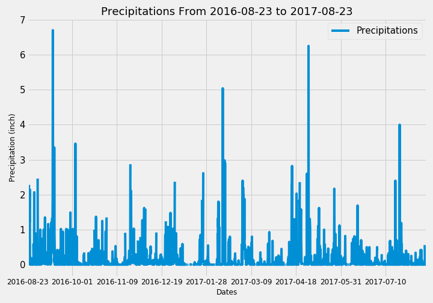

# Surfs Up!

Use Python and SQLAlchemy to do basic climate analysis and data exploration of the climate database. All of the following analysis are completed using SQLAlchemy ORM queries, Pandas, and Matplotlib.


# Database Exploration

```python
# Classes that automap found
Base.classes.keys()
```
    ['measurement', 'station']
    
```python
inspector = inspect(engine)
```
```python
# Get a list of column names and types for "station"
columns = inspector.get_columns('station')
for c in columns:
    print(c['name'], c["type"])
```
    id INTEGER
    station TEXT
    name TEXT
    latitude FLOAT
    longitude FLOAT
    elevation FLOAT
```python
# Get a list of column names and types for "measurement"
columns = inspector.get_columns('measurement')
for c in columns:
    print(c['name'], c["type"])
```

    id INTEGER
    station TEXT
    date TEXT
    prcp FLOAT
    tobs FLOAT

# Climate Analysis

## Precipitation Analysis

* Design a query to retrieve the last 12 months of precipitation data and plot the results

```python
print(f'Last Date Recorded: {last_date}\nDate one year before: {first_date}')
```

    Last Date Recorded: 2017-08-23
    Date one year before: 2016-08-23


<p align="center">
  
</p>


* Use Pandas to calculate the summary statistics for the precipitation data


<table border="1" class="dataframe">
  <thead>
    <tr style="text-align: right;">
      <th></th>
      <th>Precipitations</th>
    </tr>
  </thead>
  <tbody>
    <tr>
      <th>count</th>
      <td>2021.000000</td>
    </tr>
    <tr>
      <th>mean</th>
      <td>0.177279</td>
    </tr>
    <tr>
      <th>std</th>
      <td>0.461190</td>
    </tr>
    <tr>
      <th>min</th>
      <td>0.000000</td>
    </tr>
    <tr>
      <th>25%</th>
      <td>0.000000</td>
    </tr>
    <tr>
      <th>50%</th>
      <td>0.020000</td>
    </tr>
    <tr>
      <th>75%</th>
      <td>0.130000</td>
    </tr>
    <tr>
      <th>max</th>
      <td>6.700000</td>
    </tr>
  </tbody>
</table>
</div>


## Station Analysis

* Design a query to calculate the total number of stations.


```python
print("{} stations are available in this dataset.".format(count_stations))
```
    9 stations are available in this dataset.

* List the stations and observation counts in descending order.                             

<table border="1" class="dataframe">
  <thead>
    <tr style="text-align: right;">
      <th></th>
      <th>Station Name</th>
      <th>Observations Count</th>
    </tr>
    <tr>
      <th>Station ID</th>
      <th></th>
      <th></th>
    </tr>
  </thead>
  <tbody>
    <tr>
      <th>USC00519281</th>
      <td>WAIHEE 837.5, HI US</td>
      <td>2772</td>
    </tr>
    <tr>
      <th>USC00519397</th>
      <td>WAIKIKI 717.2, HI US</td>
      <td>2724</td>
    </tr>
    <tr>
      <th>USC00513117</th>
      <td>KANEOHE 838.1, HI US</td>
      <td>2709</td>
    </tr>
    <tr>
      <th>USC00519523</th>
      <td>WAIMANALO EXPERIMENTAL FARM, HI US</td>
      <td>2669</td>
    </tr>
    <tr>
      <th>USC00516128</th>
      <td>MANOA LYON ARBO 785.2, HI US</td>
      <td>2612</td>
    </tr>
    <tr>
      <th>USC00514830</th>
      <td>KUALOA RANCH HEADQUARTERS 886.9, HI US</td>
      <td>2202</td>
    </tr>
    <tr>
      <th>USC00511918</th>
      <td>HONOLULU OBSERVATORY 702.2, HI US</td>
      <td>1979</td>
    </tr>
    <tr>
      <th>USC00517948</th>
      <td>PEARL CITY, HI US</td>
      <td>1372</td>
    </tr>
    <tr>
      <th>USC00518838</th>
      <td>UPPER WAHIAWA 874.3, HI US</td>
      <td>511</td>
    </tr>
  </tbody>
</table>
</div>

* Which station has the highest number of observations?

```python
print("The station {} (ID:{}) has the highest number of observations with {} observations.".\
      format(most_active[0], most_active[1], most_active[2]))
```

    The station WAIHEE 837.5, HI US (ID:USC00519281) has the highest number of observations with 2772 observations.


* For the station with the highest number of observations, calculate:
    * Lowest, highest and average temperature recorded


```python
        print(f"The {records[i]} temperature recorded in {most_active[0]} is {results[i]:.1f}° F")
```

    The lowest temperature recorded in WAIHEE 837.5, HI US is 54.0° F
    The average temperature recorded in WAIHEE 837.5, HI US is 71.7° F
    The highest temperature recorded in WAIHEE 837.5, HI US is 85.0° F


* Design a query to retrieve the last 12 months of temperature observation data for the most active station and plot the results

<p align="center">
  
</p>

## Temperature Analysis I

Identify the average temperature in June and December at all stations across all available years in the dataset.

```python
# Print the average temperature at all stations across all available years in the dataset for both months.
print(f"The average temperature is {means_month1:.1f} for {calendar.month_name[int(number_month1)]} \
and {means_month2:.1f} for {calendar.month_name[int(number_month2)]}.")
```

    First month in format MM ?   06
    Month of June selected
    Second month in format MM ?   12
    Month of December selected
    The average temperature is 74.9 for June and 71.0 for December.


In order to determine whether the difference in the means is statistically significant, the unpaired t-test (Student t-test) has been chosen. Even if we have records from the same stations, we don't have the same number of records in each of these two months.

    t-stat = [31.35503692] ; p = [4.19352984e-187]
    The differences of means between June and December ARE statistically highly significant.


## Temperature Analysis II

Calculate the min, avg, and max temperatures for the trip using the last matching dates available in the dataset (i.e., use "2017-01-01" if your trip start date will be "2020-01-01").


```python
# Print the trip dates
print(f"You plan to go to Honolulu, Hawaii from {start_trip1} to {end_trip1}")
```

    Trip start in MM/DD/YYYY format?   07/14/2021
    Wed 14 Jul, 2021
    How many days?   7
    Enjoy!
    You plan to go to Honolulu, Hawaii from Wed 14 Jul, 2021 to Wed 21 Jul, 2021

```python
# Print the dayes selected to query
print(f"Period used to query will be: {start_date} to {end_date}")
```

    Period used to query will be: 2017-07-14 to 2017-07-21

```python
print(f"The {records[i]} temperature recorded is {results[i]:.1f}° F")
```

    Between 2017-07-14 and 2017-07-21:
    The lowest temperature recorded is 72.0° F
    The average temperature recorded is 78.6° F
    The highest temperature recorded is 83.0° F


* Plot the results from your previous query as a bar chart. 


<p align="center">
  
</p>

## Temperature Analysis III

Calculate the daily normals for the trip and plot them as an area plot with `stacked=False`

<p align="center">
  
</p>


## Daily Rainfall Average
Calculate the rainfall per weather station using the previous year's matching dates.


Build a DataFrame with the previous query and set the index on Station ID

<table border="1" class="dataframe">
  <thead>
    <tr style="text-align: right;">
      <th></th>
      <th>Station Name</th>
      <th>Latitude</th>
      <th>Longitude</th>
      <th>Elevation</th>
      <th>Precipitations 2017-07-14 / 2017-07-21</th>
    </tr>
    <tr>
      <th>Station ID</th>
      <th></th>
      <th></th>
      <th></th>
      <th></th>
      <th></th>
    </tr>
  </thead>
  <tbody>
    <tr>
      <th>USC00516128</th>
      <td>MANOA LYON ARBO 785.2, HI US</td>
      <td>21.33310</td>
      <td>-157.80250</td>
      <td>152.4</td>
      <td>5.14</td>
    </tr>
    <tr>
      <th>USC00519281</th>
      <td>WAIHEE 837.5, HI US</td>
      <td>21.45167</td>
      <td>-157.84889</td>
      <td>32.9</td>
      <td>0.75</td>
    </tr>
    <tr>
      <th>USC00513117</th>
      <td>KANEOHE 838.1, HI US</td>
      <td>21.42340</td>
      <td>-157.80150</td>
      <td>14.6</td>
      <td>0.42</td>
    </tr>
    <tr>
      <th>USC00514830</th>
      <td>KUALOA RANCH HEADQUARTERS 886.9, HI US</td>
      <td>21.52130</td>
      <td>-157.83740</td>
      <td>7.0</td>
      <td>0.38</td>
    </tr>
    <tr>
      <th>USC00519523</th>
      <td>WAIMANALO EXPERIMENTAL FARM, HI US</td>
      <td>21.33556</td>
      <td>-157.71139</td>
      <td>19.5</td>
      <td>0.33</td>
    </tr>
    <tr>
      <th>USC00519397</th>
      <td>WAIKIKI 717.2, HI US</td>
      <td>21.27160</td>
      <td>-157.81680</td>
      <td>3.0</td>
      <td>0.15</td>
    </tr>
    <tr>
      <th>USC00517948</th>
      <td>PEARL CITY, HI US</td>
      <td>21.39340</td>
      <td>-157.97510</td>
      <td>11.9</td>
      <td>0.00</td>
    </tr>
  </tbody>
</table>
</div>

